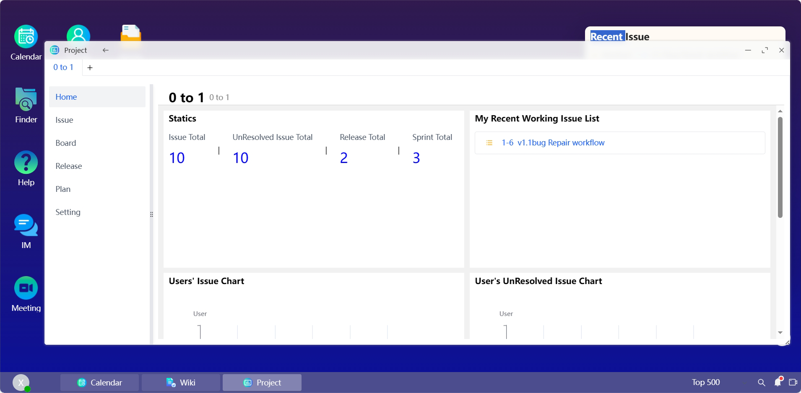
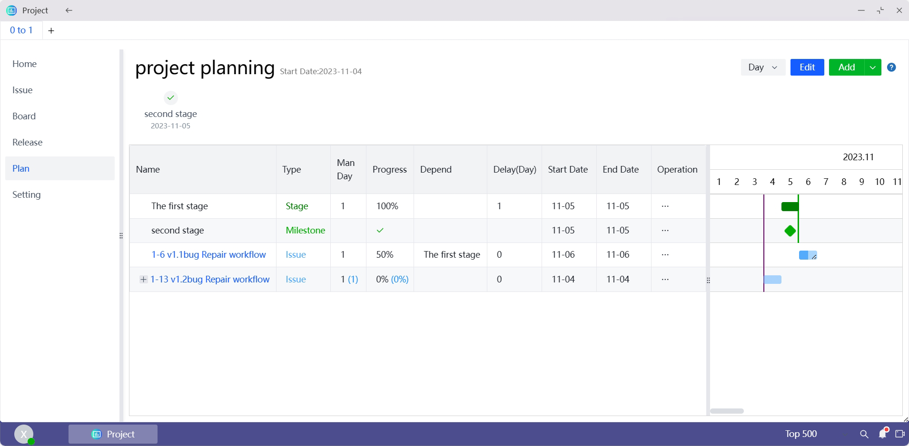
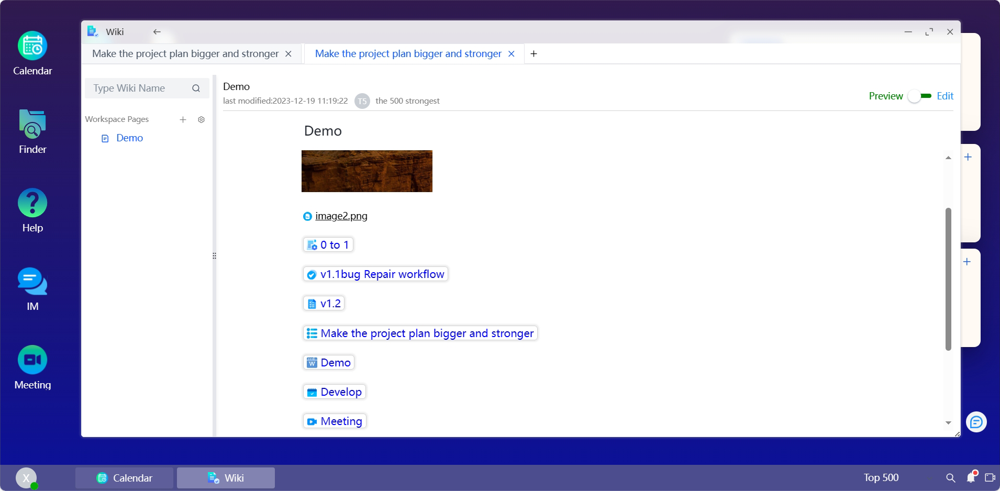
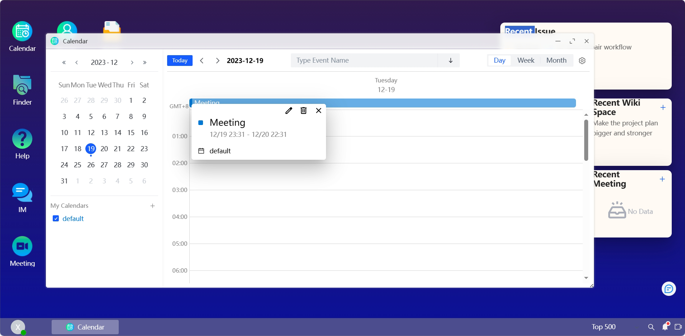
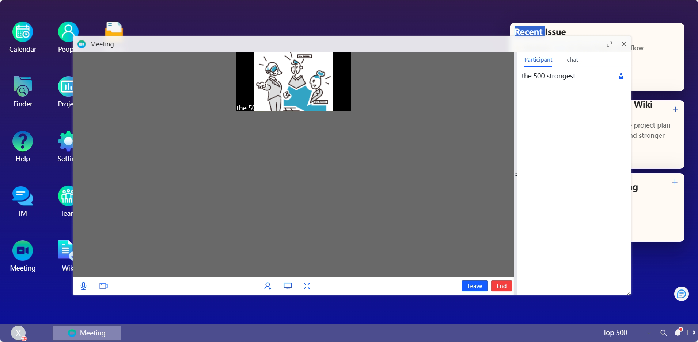
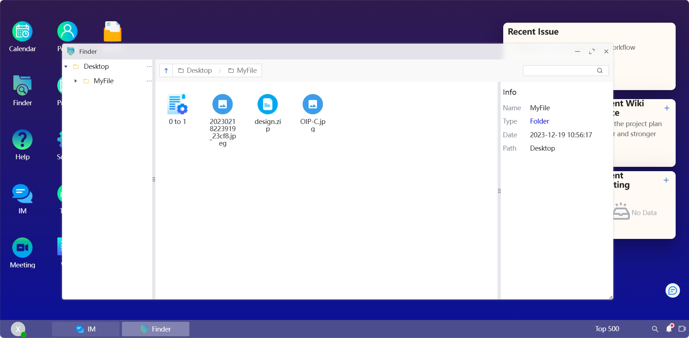
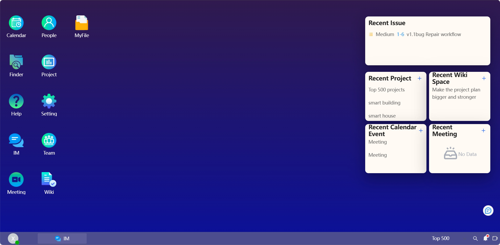

   

<h3 align="center">
Team Collaboration Solution For Enterprise Users
</h3>
<h4 align="center">
Team collaboration has never been easier
</h4>

English | 

## 📝 Introduction
Teamlinker is a team collaboration platform that integrates multi-functional modules,such as contact, task management, meeting, IM,Wiki and file management.

The platform solves the problem of efficient collaboration within the team and avoids the problem of companies using multiple tools to handle project progress, communication with colleagues and client meetings separately. Compared with traditional tools, Teamlinker not only provides basic and comprehensive collaborative office needs, but also has extremely low cost.

Teamlinker is developed based on the TeamOS system. It is a web operating system that allows users to process different tasks in parallel, similar to operating systems such as Win and Mac. It mainly contains six functional modules: project, wiki, calendar, meeting, chat and network disk. These functions are seamlessly integrated to make team collaboration smoother.

## 📋 Official website

https://team-linker.com

## 📋 Documentation
https://team-linker.com/doc/en/

## 🕐︎ Features
* Completely developed using TypeScript, using Node.js on the backend and Vue3 on the frontend.
* Created a Web OS system from scratch, realizing functions such as desktop management, multi-window, multi-tasking, file drag-and-drop, upload and download.
* Use WebRtc to realize multi-person video and voice transmission, including member invitation, screen sharing, virtual background, video blur and other functions. At the same time, conference administrator control and in-meeting chat functions are implemented.
* A block editor is developed based on HTMLElement's contentEditable, which supports free typesetting, color and font adjustment, link and picture insertion, as well as attachment addition and shortcuts.
* The project management module supports common project management functions such as custom work item types, workflows, fields, Kanban and Gantt chart management. It is completely developed using pure JavaScript and can be extracted as a separate module for use.
* The calendar part implements multi-calendar management, multi-time zone switching, free switching of day, week and month view status, supports all-day and repeated calendar events, and uses RabbitMQ to implement calendar event reminder functions.
* The IM function uses Socket.IO to realize @ everyone or specific members in the message group, message collection and search, and also includes functions such as fast video conferencing.
* The upcoming AI function uses NLP technology and the Transformers framework to create a personal work assistant to provide you with personalized services.

## 📲 Core Architecture

   

## 🔐 Installation
[Installation tutorial](./INSTALL.md)

## 💻 Local Deployment
[Local Deployment](./DEV-README.md)

## 📱 Online demo
project

document

calendar

Meeting

chat

File management

system

